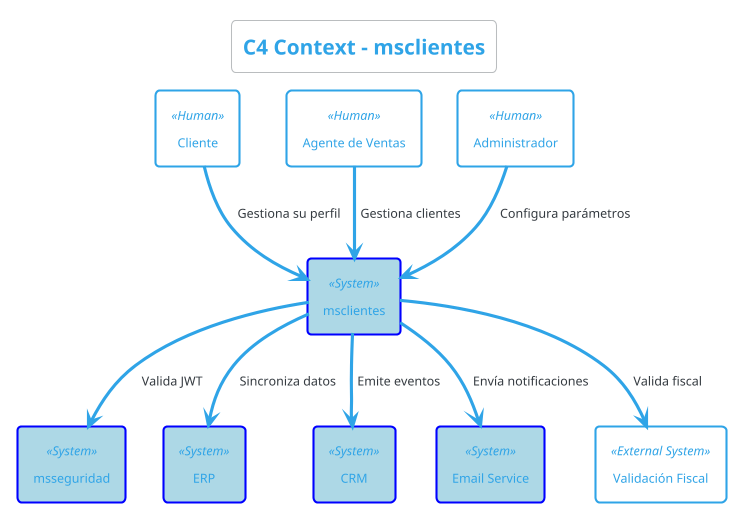
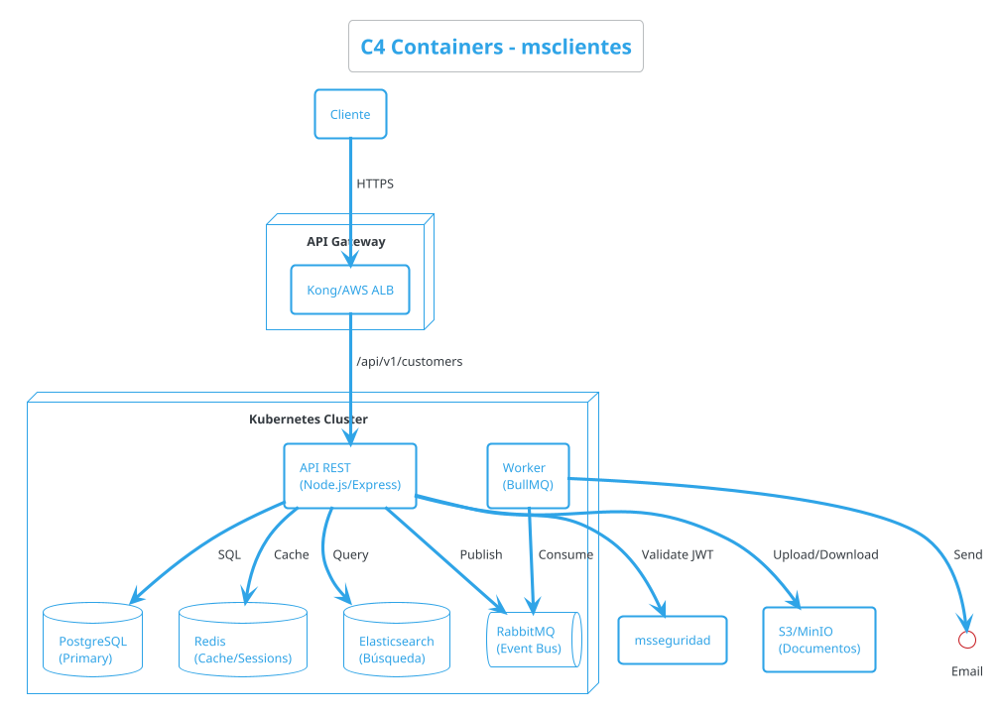
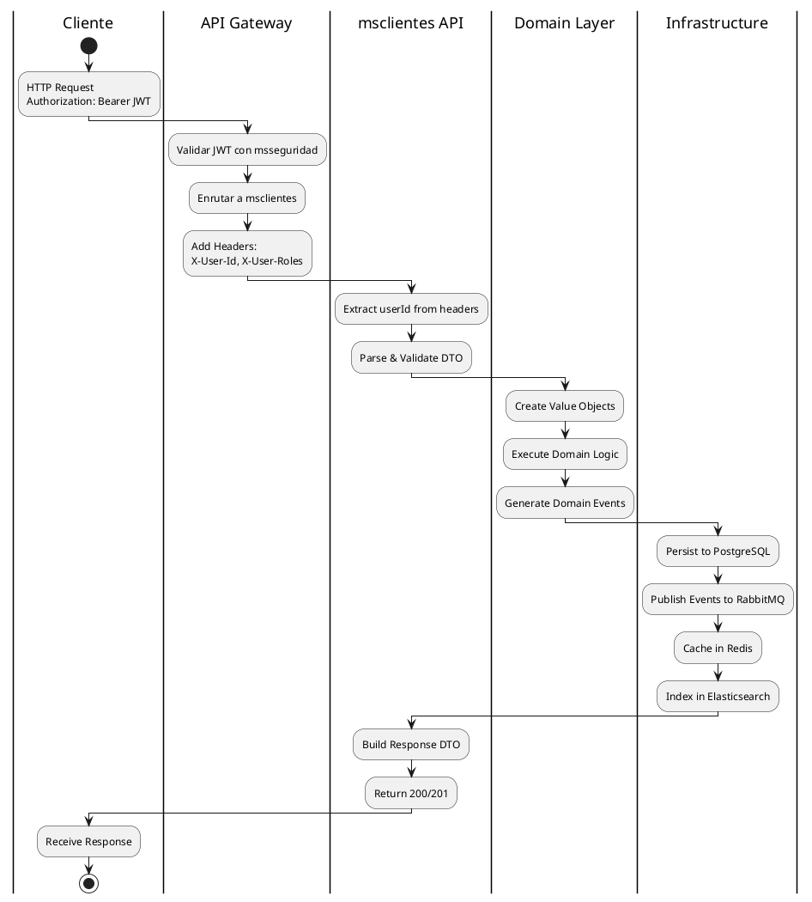
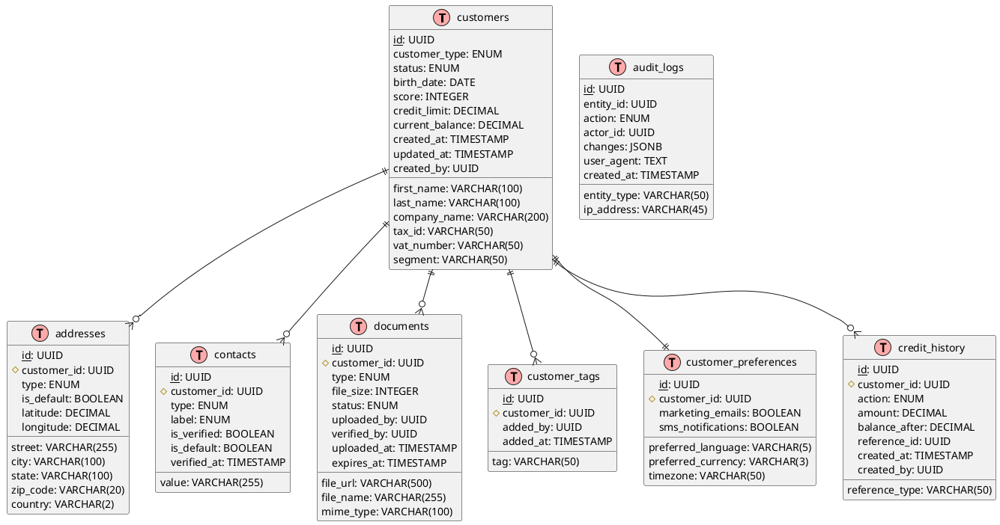
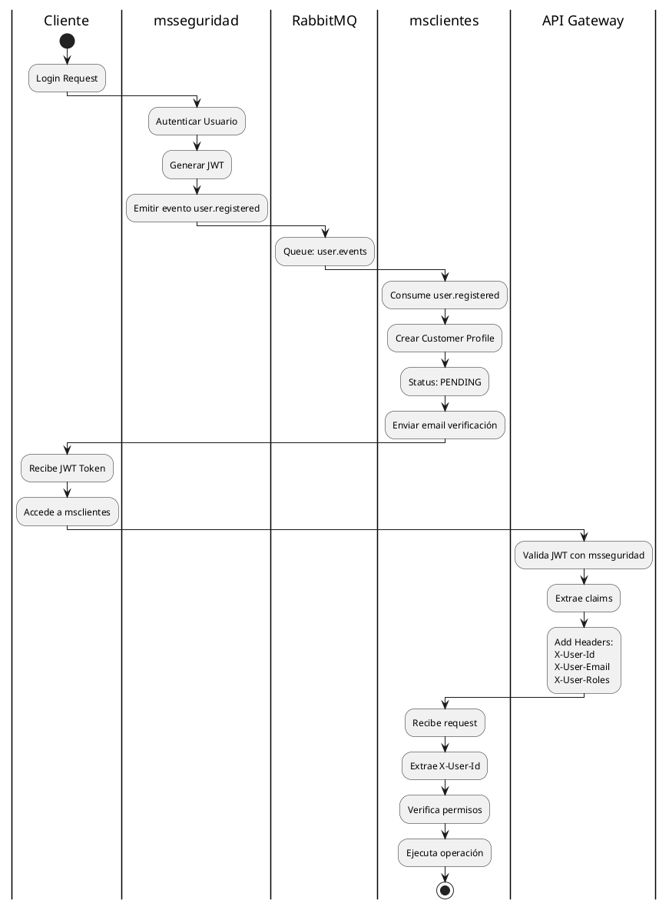
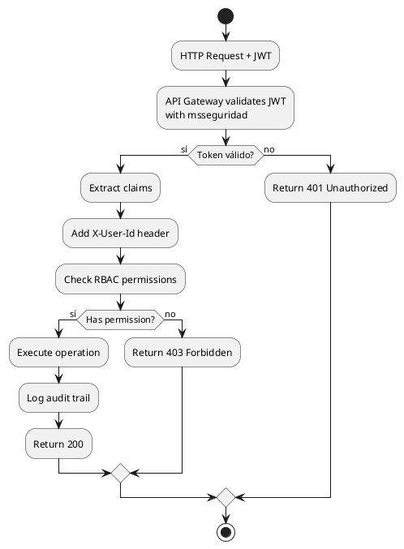
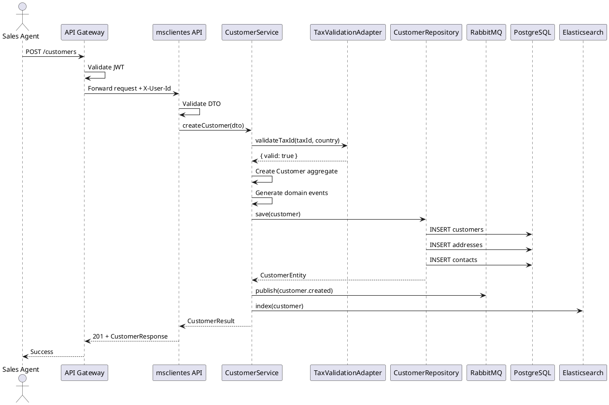

# 🏗️ PROPUESTA DE IMPLEMENTACIÓN
## Microservicio de Gestión de Clientes - msclientes

---

**Versión:** 1.0  
**Fecha:** Abril 2026  
**Autor:** Equipo de Arquitectura  
**Estado:** Propuesta Técnica  
**Stack:** Node.js, TypeScript, PostgreSQL, Clean Architecture

---

## 📑 ÍNDICE

1. [Visión General](#1-visión-general)
2. [Arquitectura de Negocio](#2-arquitectura-de-negocio)
3. [Arquitectura Técnica](#3-arquitectura-técnica)
4. [Modelo de Datos](#4-modelo-de-datos)
5. [API REST](#5-api-rest)
6. [Integraciones](#6-integraciones)
7. [Seguridad](#7-seguridad)
8. [Plan de Implementación](#8-plan-de-implementación)
9. [Anexos](#9-anexos)

---

## 1. VISIÓN GENERAL

### 1.1 Propósito
Implementar un microservicio de gestión de clientes (msclientes) que centralice toda la información de clientes B2B y B2C, con arquitectura moderna, escalable y segura.

### 1.2 Objetivos
- ✅ Gestión completa del ciclo de vida del cliente
- ✅ Master Data Management (MDM) robusto
- ✅ Integración seamless con msseguridad
- ✅ Cumplimiento GDPR/CCPA
- ✅ Alta disponibilidad (99.9% SLA)

### 1.3 Principios de Diseño
- **Single Responsibility:** Cada servicio hace una cosa bien
- **Event-Driven:** Comunicación asíncrona entre servicios
- **API First:** Diseño contract-first con OpenAPI
- **Security by Design:** Seguridad en cada capa

---

## 2. ARQUITECTURA DE NEGOCIO

### 2.1 Contexto del Sistema (C4 - Context)



### 2.2 Contenedores (C4 - Container)



---

## 3. ARQUITECTURA TÉCNICA

### 3.1 Vista de Componentes (Clean Architecture)

```
┌─────────────────────────────────────────────────────────────────┐
│                    CLEAN ARCHITECTURE                           │
├─────────────────────────────────────────────────────────────────┤
│  INTERFACES LAYER                                               │
│  ├─ Controllers (Customer, Address, Document, Tax)             │
│  ├─ Middlewares (Auth, Validation, Audit, RateLimit)           │
│  ├─ Routes                                                      │
│  └─ DTOs (Request/Response)                                    │
├─────────────────────────────────────────────────────────────────┤
│  APPLICATION LAYER                                              │
│  ├─ Services (CustomerService, ValidationService)              │
│  ├─ Use Cases (CreateCustomer, UpdateProfile, ValidateTax)     │
│  ├─ Ports (Repository Interfaces)                              │
│  └─ DTOs                                                        │
├─────────────────────────────────────────────────────────────────┤
│  DOMAIN LAYER                                                   │
│  ├─ Entities (Customer, Address, Contact, Document)              │
│  ├─ Value Objects (Email, Phone, TaxId, Money)                │
│  ├─ Domain Services (CreditCalculator, SegmentScorer)          │
│  ├─ Repository Interfaces                                       │
│  └─ Domain Events (CustomerCreated, ProfileUpdated)           │
├─────────────────────────────────────────────────────────────────┤
│  INFRASTRUCTURE LAYER                                           │
│  ├─ Repositories (TypeORM implementations)                     │
│  ├─ Adapters (TaxValidationAdapter, EmailAdapter)              │
│  ├─ External APIs (VIES, GoogleMaps, Clearbit)                │
│  ├─ Messaging (RabbitMQ Publisher/Consumer)                    │
│  └─ Config (Database, Redis, Environment)                     │
└─────────────────────────────────────────────────────────────────┘
```

### 3.2 Stack Tecnológico

| Capa | Tecnología | Versión |
|------|------------|---------|
| **Runtime** | Node.js | 20 LTS |
| **Lenguaje** | TypeScript | 5.x |
| **Framework** | Express.js | 4.x |
| **Base de Datos** | PostgreSQL | 15+ |
| **ORM** | TypeORM | 0.3.x |
| **Caché** | Redis | 7 |
| **Búsqueda** | Elasticsearch | 8.x |
| **Colas** | RabbitMQ | 3.x |
| **Jobs** | BullMQ | 4.x |
| **Documentos** | S3 / MinIO | - |
| **Testing** | Jest | 29.x |
| **Validación** | class-validator | 0.14.x |
| **Documentación** | Swagger/OpenAPI | 3.x |

### 3.3 Flujo de Datos



---

## 4. MODELO DE DATOS

### 4.1 Diagrama Entidad-Relación



### 4.2 Diccionario de Datos

#### Tabla: customers
| Campo | Tipo | Constraints | Descripción |
|-------|------|-------------|-------------|
| id | UUID | PK | Identificador único |
| customer_type | ENUM(INDIVIDUAL, BUSINESS) | NOT NULL | Tipo de cliente |
| status | ENUM | NOT NULL | Estado actual |
| tax_id | VARCHAR(50) | UNIQUE | Identificación fiscal |
| credit_limit | DECIMAL(15,2) | DEFAULT 0 | Límite de crédito |
| segment | VARCHAR(50) | - | Segmento asignado |
| score | INTEGER | CHECK 0-100 | Puntuación 0-100 |

#### Tabla: addresses
| Campo | Tipo | Constraints | Descripción |
|-------|------|-------------|-------------|
| id | UUID | PK | Identificador |
| customer_id | UUID | FK | Referencia a cliente |
| type | ENUM | NOT NULL | Tipo de dirección |
| country | VARCHAR(2) | NOT NULL | Código ISO país |
| latitude | DECIMAL(10,8) | - | Coordenada lat |
| longitude | DECIMAL(11,8) | - | Coordenada lng |

---

## 5. API REST

### 5.1 OpenAPI Specification (Resumen)

```yaml
openapi: 3.0.0
info:
  title: msclientes API
  version: 1.0.0
  description: API de gestión de clientes

servers:
  - url: http://localhost:3001/api/v1

paths:
  /customers:
    post:
      summary: Crear cliente
      tags: [Customers]
      requestBody:
        required: true
        content:
          application/json:
            schema:
              $ref: '#/components/schemas/CreateCustomerDto'
      responses:
        201:
          description: Cliente creado
          content:
            application/json:
              schema:
                $ref: '#/components/schemas/CustomerResponse'
    
    get:
      summary: Listar clientes
      tags: [Customers]
      parameters:
        - name: page
          in: query
          schema: { type: integer, default: 1 }
        - name: limit
          in: query
          schema: { type: integer, default: 20 }
        - name: type
          in: query
          schema: { type: string, enum: [INDIVIDUAL, BUSINESS] }
        - name: status
          in: query
          schema: { type: string }
        - name: search
          in: query
          schema: { type: string }
      responses:
        200:
          description: Lista paginada
          content:
            application/json:
              schema:
                $ref: '#/components/schemas/PaginatedCustomers'

  /customers/{id}:
    get:
      summary: Obtener cliente por ID
      tags: [Customers]
      parameters:
        - name: id
          in: path
          required: true
          schema: { type: string, format: uuid }
      responses:
        200:
          description: Cliente encontrado
        404:
          description: Cliente no encontrado
    
    patch:
      summary: Actualizar cliente parcialmente
      tags: [Customers]
      requestBody:
        content:
          application/json:
            schema:
              $ref: '#/components/schemas/UpdateCustomerDto'
      responses:
        200:
          description: Cliente actualizado

  /customers/{id}/addresses:
    post:
      summary: Agregar dirección
      tags: [Addresses]
      requestBody:
        content:
          application/json:
            schema:
              $ref: '#/components/schemas/CreateAddressDto'
      responses:
        201:
          description: Dirección creada

  /customers/{id}/documents:
    post:
      summary: Subir documento
      tags: [Documents]
      requestBody:
        content:
          multipart/form-data:
            schema:
              type: object
              properties:
                file:
                  type: string
                  format: binary
                type:
                  type: string
      responses:
        201:
          description: Documento subido

  /customers/search:
    get:
      summary: Búsqueda avanzada (Elasticsearch)
      tags: [Search]
      parameters:
        - name: q
          in: query
          required: true
          description: Query de búsqueda
      responses:
        200:
          description: Resultados de búsqueda

  /customers/validate/tax-id:
    post:
      summary: Validar número fiscal
      tags: [Validation]
      requestBody:
        content:
          application/json:
            schema:
              type: object
              properties:
                taxId: { type: string }
                country: { type: string }
      responses:
        200:
          description: Resultado de validación

components:
  schemas:
    CreateCustomerDto:
      type: object
      required: [customerType, email, taxId]
      properties:
        customerType:
          type: string
          enum: [INDIVIDUAL, BUSINESS]
        email:
          type: string
          format: email
        firstName:
          type: string
          minLength: 2
          maxLength: 100
        lastName:
          type: string
          minLength: 2
          maxLength: 100
        companyName:
          type: string
          maxLength: 200
        taxId:
          type: string
        birthDate:
          type: string
          format: date
        phone:
          type: string
        addresses:
          type: array
          items:
            $ref: '#/components/schemas/CreateAddressDto'

    CreateAddressDto:
      type: object
      required: [type, street, city, country]
      properties:
        type:
          type: string
          enum: [billing, shipping, fiscal, other]
        street:
          type: string
          maxLength: 255
        city:
          type: string
          maxLength: 100
        state:
          type: string
          maxLength: 100
        zipCode:
          type: string
          maxLength: 20
        country:
          type: string
          minLength: 2
          maxLength: 2
        isDefault:
          type: boolean
          default: false
```

### 5.2 Ejemplos de Requests/Responses

#### Crear Cliente B2B
```bash
curl -X POST http://localhost:3001/api/v1/customers \
  -H "Authorization: Bearer <JWT>" \
  -H "Content-Type: application/json" \
  -d '{
    "customerType": "BUSINESS",
    "companyName": "TechCorp Argentina S.A.",
    "taxId": "30-12345678-9",
    "email": "contacto@techcorp.com",
    "phone": "+54 11 1234-5678",
    "addresses": [{
      "type": "fiscal",
      "street": "Av. Corrientes 1234, Piso 5",
      "city": "CABA",
      "state": "Buenos Aires",
      "zipCode": "C1043",
      "country": "AR",
      "isDefault": true
    }],
    "industry": "TECHNOLOGY",
    "employeeCount": 50
  }'
```

**Response 201:**
```json
{
  "success": true,
  "data": {
    "id": "550e8400-e29b-41d4-a716-446655440000",
    "customerType": "BUSINESS",
    "status": "PENDING",
    "companyName": "TechCorp Argentina S.A.",
    "taxId": "30-12345678-9",
    "email": "contacto@techcorp.com",
    "addresses": [...],
    "createdAt": "2026-04-17T10:30:00Z",
    "verificationRequired": true
  }
}
```

---

## 6. INTEGRACIONES

### 6.1 Integración con msseguridad



### 6.2 Eventos del Sistema

| Evento | Publisher | Consumer | Descripción |
|--------|-----------|----------|-------------|
| `customer.created` | msclientes | CRM, Marketing | Nuevo cliente registrado |
| `customer.updated` | msclientes | ERP, CRM | Datos de cliente modificados |
| `customer.status.changed` | msclientes | msseguridad | Cambio de estado (activación/suspensión) |
| `customer.credit.limit.exceeded` | msclientes | Orders | Cliente superó límite de crédito |
| `document.verified` | msclientes | msseguridad | Documento fiscal verificado |
| `user.registered` | msseguridad | msclientes | Crear perfil de cliente automáticamente |

### 6.3 APIs Externas

| Servicio | Uso | Implementación |
|----------|-----|----------------|
| **Google Maps Geocoding** | Validar y geocodificar direcciones | Adapter pattern, fallback a cache |
| **VIES (EU VAT)** | Validar VAT numbers europeos | REST API, respuesta cacheada 24h |
| **AFIP (Argentina)** | Validar CUIT | REST API con certificado digital |
| **Clearbit** | Enriquecimiento de datos B2B | REST API, rate limiting |
| **AWS SES / SendGrid** | Envío de emails | SMTP/API, templates HTML |

---

## 7. SEGURIDAD

### 7.1 Autenticación y Autorización



### 7.2 Roles y Permisos

| Rol | Permisos |
|-----|----------|
| `CUSTOMER_ADMIN` | CRUD completo, exportar, eliminar definitivo |
| `CUSTOMER_MANAGER` | CRUD, cambiar estado, asignar crédito |
| `CUSTOMER_VIEWER` | Solo lectura, búsquedas |
| `SALES_REP` | Ver clientes asignados, editar propios |
| `SUPPORT_AGENT` | Ver, editar notas, subir documentos |
| `CUSTOMER` | Ver/Editar propio perfil, subir documentos |

### 7.3 Protección de Datos

| Medida | Implementación |
|--------|----------------|
| **Encriptación en reposo** | AES-256 para campos PII (PostgreSQL pgcrypto) |
| **Encriptación en tránsito** | TLS 1.3 obligatorio |
| **Tokenización** | Datos bancarios → Vault (HashiCorp/AWS KMS) |
| **Masking** | Logs con datos sensibles enmascarados |
| **Field-level encryption** | SSN, Tax ID almacenados encriptados |

### 7.4 Compliance

| Requisito | Implementación |
|-----------|----------------|
| **GDPR Right to erasure** | Endpoint `/customers/:id/anonymize` |
| **GDPR Data portability** | Export JSON con esquema estándar |
| **GDPR Consent tracking** | Tabla consent_history con versionado |
| **Audit trail** | Tabla audit_logs inmutable |
| **Data retention** | Jobs automáticos para purga según política |

---

## 8. PLAN DE IMPLEMENTACIÓN

### 8.1 Roadmap

```
┌─────────────────────────────────────────────────────────────────┐
│                    ROADMAP DE IMPLEMENTACIÓN                  │
└─────────────────────────────────────────────────────────────────┘

Q2 2026 (3 meses)          Q3 2026 (3 meses)          Q4 2026 (2 meses)
┌──────────────────┐      ┌──────────────────┐      ┌──────────┐
│ MVP - Core        │      │ Feature Complete │      │ Optimize │
│                   │      │                  │      │          │
│ • Setup proyecto │─────▶│ • Búsqueda ES    │─────▶│ • ML     │
│ • CRUD clientes  │      │ • Import masivo  │      │   Scoring│
│ • Direcciones    │      │ • Reporting      │      │ • Cache  │
│ • Contactos      │      │ • Multi-tenant   │      │   Opt    │
│ • Integración    │      │ • Analytics      │      │ • GDPR   │
│   msseguridad    │      │ • Workflow       │      │   Full   │
└──────────────────┘      └──────────────────┘      └──────────┘
```

### 8.2 Fases Detalladas

#### FASE 1: Setup y Core (Semanas 1-3)
- [ ] Scaffolding del proyecto (Node.js, TypeORM, PostgreSQL)
- [ ] Configuración Docker Compose local
- [ ] Integración con msseguridad (JWT validation)
- [ ] CRUD completo de customers
- [ ] Gestión de direcciones (CRUD, geocodificación)
- [ ] Tests unitarios > 80%

#### FASE 2: Datos Fiscales y Documentos (Semanas 4-5)
- [ ] Campos fiscales (Tax ID, VAT)
- [ ] Validación externa de tax IDs
- [ ] Upload de documentos (S3/MinIO)
- [ ] Workflow de verificación de documentos
- [ ] Eventos asíncronos (RabbitMQ setup)

#### FASE 3: Segmentación y Búsqueda (Semanas 6-7)
- [ ] Sistema de tags flexible
- [ ] Segmentación automática (reglas)
- [ ] Integración Elasticsearch
- [ ] Búsqueda full-text avanzada
- [ ] Scoring básico de clientes

#### FASE 4: Crédito y Compliance (Semanas 8-9)
- [ ] Gestión de límites de crédito
- [ ] Historial crediticio
- [ ] GDPR: anonimización y exportación
- [ ] Consent tracking
- [ ] Audit logs completo

#### FASE 5: Enterprise Features (Semanas 10-12)
- [ ] Importación masiva (CSV/Excel)
- [ ] Exportación programada
- [ ] Reportes y dashboards
- [ ] Caché avanzado (Redis)
- [ ] Documentación API completa (Swagger)

### 8.3 Dependencias

| Tarea | Depende de | Esfuerzo |
|-------|------------|-----------|
| CRUD Customers | Setup proyecto | 3 días |
| Direcciones | CRUD Customers | 2 días |
| Validación Tax | Direcciones, API externa | 3 días |
| Elasticsearch | CRUD Customers, infra ES | 4 días |
| Eventos RabbitMQ | Setup messaging | 2 días |
| GDPR features | Audit logging | 3 días |

### 8.4 Estimación de Esfuerzo

| Fase | Esfuerzo | Equipo |
|------|----------|--------|
| Fase 1 | 3 semanas | 2 devs |
| Fase 2 | 2 semanas | 2 devs |
| Fase 3 | 2 semanas | 2 devs |
| Fase 4 | 2 semanas | 2 devs |
| Fase 5 | 3 semanas | 2 devs |
| **Total** | **12 semanas** | **2 devs** |

---

## 9. ANEXOS

### A. Diagrama de Secuencia - Crear Cliente



### B. Estrategia de Testing

| Tipo | Cobertura | Herramientas |
|------|-----------|--------------|
| **Unit tests** | > 80% | Jest, mocks |
| **Integration tests** | Repositories, Adapters | Jest, TestContainers |
| **E2E tests** | API endpoints | Supertest, Jest |
| **Contract tests** | APIs externas | Pact |
| **Security tests** | Auth, injection | OWASP ZAP |

### C. Configuración de Entorno

```bash
# .env.example
NODE_ENV=development
PORT=3001

# Database
DB_HOST=localhost
DB_PORT=5432
DB_NAME=msclientes
DB_USER=postgres
DB_PASSWORD=secret

# Redis
REDIS_HOST=localhost
REDIS_PORT=6379

# Elasticsearch
ES_HOST=http://localhost:9200

# RabbitMQ
RABBITMQ_URL=amqp://localhost:5672

# External APIs
GOOGLE_MAPS_API_KEY=xxx
CLEARBIT_API_KEY=xxx

# Integration
MSSEGURIDAD_URL=http://localhost:3000
API_GATEWAY_URL=http://localhost:8080
```

### D. Métricas de Éxito

| KPI | Valor Objetivo | Medición |
|-----|----------------|----------|
| API Response Time (p95) | < 100ms | Prometheus |
| Availability | 99.9% | Uptime monitoring |
| Test Coverage | > 80% | Jest reports |
| Code Quality | A (SonarQube) | Sonar analysis |
| Customer Satisfaction | > 4.5/5 | NPS surveys |

---

**Documento preparado por:** Equipo de Arquitectura  
**Fecha:** Abril 2026  
**Versión:** 1.0  
**Estado:** Aprobado para implementación
