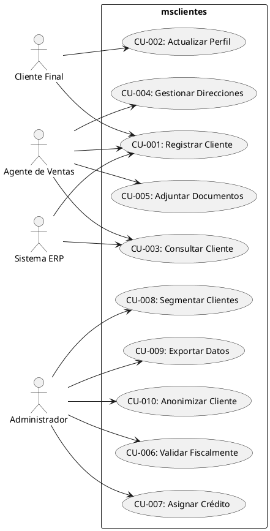

# 📋 DOCUMENTO DE REQUERIMIENTOS
## Microservicio de Gestión de Clientes - msclientes

---

**Versión:** 1.0  
**Fecha:** Abril 2026  
**Proyecto:** msclientes  
**Tipo:** Elicitación de Requerimientos  
**Dependencia:** msseguridad (autenticación/autorización)

---

## 📑 ÍNDICE

1. [Introducción](#1-introducción)
2. [Requerimientos Funcionales](#2-requerimientos-funcionales)
3. [Requerimientos No Funcionales](#3-requerimientos-no-funcionales)
4. [Reglas de Negocio](#4-reglas-de-negocio)
5. [Casos de Uso](#5-casos-de-uso)
6. [Matriz de Trazabilidad](#6-matríz-de-trazabilidad)
7. [Glosario](#7-glosario)

---

## 1. INTRODUCCIÓN

### 1.1 Propósito
El microservicio msclientes gestionará toda la información relacionada con clientes (personas físicas y jurídicas), sus datos de contacto, direcciones, información fiscal y preferencias. Trabaja en conjunto con msseguridad para autenticación y autorización.

### 1.2 Alcance
- Gestión completa del ciclo de vida del cliente
- Datos maestros de clientes (Master Data Management)
- Integración con servicios externos de validación
- Segmentación y scoring de clientes
- Cumplimiento normativo (GDPR/CCPA)

### 1.3 Definiciones y Acrónimos

| Término | Definición |
|---------|------------|
| **MDM** | Master Data Management - Gestión de datos maestros |
| **PII** | Personally Identifiable Information - Datos personales identificables |
| **B2B** | Business to Business - Empresa a empresa |
| **B2C** | Business to Consumer - Empresa a consumidor |
| **KYC** | Know Your Customer - Conocer al cliente |
| **GDPR** | General Data Protection Regulation - Reglamento UE |
| **VAT** | Value Added Tax - IVA |

---

## 2. REQUERIMIENTOS FUNCIONALES

### 2.1 Gestión de Clientes (CRUD)

#### RF-001: Crear Cliente
**Descripción:** El sistema debe permitir crear nuevos clientes con datos básicos.  
**Prioridad:** Alta  
**Entrada:** Datos personales/empresariales  
**Proceso:** Validación → Creación → Asignación ID único  
**Salida:** Cliente creado con estado PENDING  
**Reglas:** RF-NEG-001, RF-NEG-002

#### RF-002: Actualizar Cliente
**Descripción:** Permitir modificar datos del cliente existente.  
**Prioridad:** Alta  
**Restricciones:** No se puede modificar ID ni tipo de cliente  
**Auditoría:** Todos los cambios deben registrarse

#### RF-003: Consultar Cliente
**Descripción:** Obtener información completa de un cliente.  
**Prioridad:** Alta  
**Filtros:** Por ID, email, taxId  
**Seguridad:** Solo usuarios autorizados

#### RF-004: Eliminar Cliente
**Descripción:** Eliminación lógica (soft delete) del cliente.  
**Prioridad:** Media  
**Condición:** No debe tener operaciones activas  
**Regla:** Solo ADMIN puede eliminar definitivamente

#### RF-005: Listar Clientes
**Descripción:** Listado paginado con filtros y ordenamiento.  
**Prioridad:** Alta  
**Filtros:** Tipo, estado, segmento, fecha, tags  
**Ordenamiento:** Nombre, fecha creación, última compra

### 2.2 Gestión de Direcciones

#### RF-006: Agregar Dirección
**Descripción:** Permitir múltiples direcciones por cliente.  
**Tipos:** billing, shipping, fiscal, other  
**Validación:** Geocodificación automática

#### RF-007: Establecer Dirección Predeterminada
**Descripción:** Marcar una dirección como principal por tipo.  
**Restricción:** Solo una dirección predeterminada por tipo

#### RF-008: Validación de Dirección
**Descripción:** Integración con APIs de validación postal.  
**Validación:** Formato correcto, código postal existente

### 2.3 Datos de Contacto

#### RF-009: Gestión de Emails
**Descripción:** Múltiples emails con verificación.  
**Tipos:** primary, work, other  
**Verificación:** Envío de email de confirmación

#### RF-010: Gestión de Teléfonos
**Descripción:** Múltiples números telefónicos.  
**Formato:** E.164 internacional  
**Validación:** Verificación de formato

#### RF-011: Canal de Contacto Preferido
**Descripción:** Cliente define cómo prefiere ser contactado.  
**Opciones:** email, phone, sms, whatsapp

### 2.4 Datos Fiscales y Financieros

#### RF-012: Información Fiscal
**Descripción:** Gestión de datos fiscales por país.  
**Campos:** Tax ID, VAT Number, Business Type  
**Validación:** Algoritmo específico por país

#### RF-013: Límite de Crédito
**Descripción:** Asignar y gestionar límites de crédito.  
**Cálculo:** Disponible = Límite - Balance actual  
**Alertas:** Notificación cuando alcance 80%

#### RF-014: Historial Crediticio
**Descripción:** Registro de pagos y comportamiento crediticio.  
**Datos:** Fechas de pago, montos, morosidad

### 2.5 Documentos

#### RF-015: Adjuntar Documentos
**Descripción:** Subir documentos al perfil del cliente.  
**Tipos:** ID, tax certificate, contracts, NDAs  
**Validación:** Tipo MIME, tamaño máximo 10MB

#### RF-016: Verificación de Documentos
**Descripción:** Proceso de revisión y aprobación.  
**Estados:** pending, verified, rejected  
**Notificación:** Email al cliente sobre resultado

### 2.6 Segmentación y Clasificación

#### RF-017: Etiquetado (Tags)
**Descripción:** Sistema flexible de etiquetado.  
**Ejemplos:** VIP, HIGH_VALUE, AT_RISK  
**Operaciones:** Agregar, quitar, buscar por tags

#### RF-018: Segmentación Automática
**Descripción:** Asignación automática de segmentos.  
**Criterios:** Compras, frecuencia, valor, engagement

#### RF-019: Score de Cliente
**Descripción:** Cálculo de puntuación compuesta.  
**Factores:** CLV, engagement, satisfacción, frecuencia  
**Rango:** 0-100

### 2.7 Búsqueda y Reportes

#### RF-020: Búsqueda Avanzada
**Descripción:** Búsqueda full-text con filtros complejos.  
**Tecnología:** Elasticsearch  
**Campos:** Nombre, email, teléfono, dirección

#### RF-021: Exportación de Datos
**Descripción:** Exportar listados a CSV/Excel.  
**Seguridad:** Solo usuarios con permiso EXPORT  
**Formatos:** CSV, Excel, JSON

### 2.8 Integraciones

#### RF-022: Validación Externa
**Descripción:** Integración con APIs de validación.  
**Servicios:** VIES (VAT), AFIP (AR), Google Maps (direcciones)

#### RF-023: Sincronización con ERP
**Descripción:** Sincronización bidireccional de datos.  
**Frecuencia:** Real-time vía eventos

#### RF-024: Enriquecimiento de Datos
**Descripción:** Complementar datos con fuentes externas.  
**Fuentes:** Clearbit, ZoomInfo, Dun & Bradstreet

### 2.9 Compliance y Privacidad

#### RF-025: Derecho al Olvido
**Descripción:** Anonimización de datos personales.  
**Proceso:** Preservar referencias, eliminar PII  
**Conservación:** Datos fiscales según legislación local

#### RF-026: Portabilidad de Datos
**Descripción:** Exportar datos del cliente en formato estándar.  
**Formato:** JSON con esquema definido  
**Entrega:** Descarga directa o email

#### RF-027: Gestión de Consentimientos
**Descripción:** Tracking de consentimientos explícitos.  
**Tipos:** Marketing, datos compartidos, términos  
**Histórico:** Versionado de consentimientos

---

## 3. REQUERIMIENTOS NO FUNCIONALES

### 3.1 Rendimiento

| Código | Requerimiento | Métrica | Prioridad |
|--------|---------------|---------|-----------|
| RNF-001 | Tiempo de respuesta API | < 100ms (p95) | Alta |
| RNF-002 | Throughput sostenido | 1000 req/s | Alta |
| RNF-003 | Búsqueda full-text | < 200ms | Media |
| RNF-004 | Exportación de datos | < 30s para 10K registros | Media |

### 3.2 Disponibilidad

| Código | Requerimiento | Métrica | Prioridad |
|--------|---------------|---------|-----------|
| RNF-005 | Uptime | 99.9% (SLA) | Alta |
| RNF-006 | RTO (Recovery Time Objective) | < 15 minutos | Alta |
| RNF-007 | RPO (Recovery Point Objective) | < 5 minutos | Alta |

### 3.3 Seguridad

| Código | Requerimiento | Implementación | Prioridad |
|--------|---------------|----------------|-----------|
| RNF-008 | Encriptación en reposo | AES-256 para PII | Alta |
| RNF-009 | Encriptación en tránsito | TLS 1.3 | Alta |
| RNF-010 | Tokenización datos bancarios | Vault/tokenization service | Alta |
| RNF-011 | Auditoría completa | Log inmutable de operaciones | Alta |
| RNF-012 | Rate limiting | 100 req/min por IP | Media |

### 3.4 Escalabilidad

| Código | Requerimiento | Métrica | Prioridad |
|--------|---------------|---------|-----------|
| RNF-013 | Escalabilidad horizontal | Auto-scaling 2-20 pods | Alta |
| RNF-014 | Particionamiento de datos | Por región/país | Media |
| RNF-015 | Caché distribuido | Redis cluster | Media |

### 3.5 Mantenibilidad

| Código | Requerimiento | Métrica | Prioridad |
|--------|---------------|---------|-----------|
| RNF-016 | Cobertura de tests | > 80% | Alta |
| RNF-017 | Documentación API | OpenAPI/Swagger | Alta |
| RNF-018 | Monitoreo | Métricas en Prometheus/Grafana | Alta |

### 3.6 Usabilidad

| Código | Requerimiento | Métrica | Prioridad |
|--------|---------------|---------|-----------|
| RNF-019 | API intuitiva | RESTful estándar | Alta |
| RNF-020 | Mensajes de error claros | Código + descripción + sugerencia | Media |
| RNF-021 | Versionado de API | /api/v1/, /api/v2/ | Alta |

---

## 4. REGLAS DE NEGOCIO

### 4.1 Validaciones de Negocio

#### RF-NEG-001: Unicidad de Email
**Descripción:** El email debe ser único en el sistema.  
**Excepción:** Clientes B2B pueden compartir email de contacto si tienen taxId diferente.

#### RF-NEG-002: Unicidad de Tax ID
**Descripción:** El número fiscal debe ser único por país.  
**Validación:** Algoritmo específico por país (CUIT Argentina, CNPJ Brasil, etc.)

#### RF-NEG-003: Dirección de Facturación Obligatoria
**Descripción:** Todo cliente activo debe tener al menos una dirección de facturación.  
**Validación:** No se puede activar cliente sin dirección fiscal válida.

#### RF-NEG-004: Verificación para Activación
**Descripción:** Cliente en estado PENDING debe completar verificación antes de activarse.  
**Proceso:** Verificación email + documento (B2B)

#### RF-NEG-005: Límite de Direcciones
**Descripción:** Máximo 10 direcciones por cliente.  
**Excepción:** Casos especiales aprobados por ADMIN.

#### RF-NEG-006: Retención de Datos
**Descripción:** Datos fiscales deben conservarse 10 años.  
**Aplicación:** Aunque cliente solicite "derecho al olvido", datos fiscales se preservan.

### 4.2 Cálculos y Fórmulas

#### RF-NEG-007: Cálculo de Límite de Crédito Disponible
```
Crédito Disponible = Límite Aprobado - Balance Actual - Órdenes Pendientes
```

#### RF-NEG-008: Score de Cliente (0-100)
```
Score = (CLV × 0.3) + (Engagement × 0.25) + (Satisfacción × 0.25) + (Frecuencia × 0.2)
```

#### RF-NEG-009: Segmentación Automática
| Score | Segmento |
|-------|----------|
| 0-25 | Low Value |
| 26-50 | Standard |
| 51-75 | Gold |
| 76-100 | Platinum |

---

## 5. CASOS DE USO

### 5.1 Diagrama de Casos de Uso (PlantUML)



### 5.2 Especificación de Casos de Uso

#### CU-001: Registrar Cliente

**Actor:** Agente de Ventas, Cliente Final  
**Precondición:** Usuario autenticado en msseguridad  
**Postcondición:** Cliente creado en estado PENDING

**Flujo Principal:**
1. Usuario accede a formulario de registro
2. Sistema valida token JWT con msseguridad
3. Usuario ingresa datos básicos (tipo, nombre, email)
4. Sistema valida unicidad de email
5. Usuario ingresa dirección de facturación
6. Sistema geocodifica y valida dirección
7. Usuario ingresa datos fiscales (si B2B)
8. Sistema valida tax ID con algoritmo de país
9. Sistema crea cliente con estado PENDING
10. Sistema emite evento `customer.created`
11. Sistema envía email de verificación

**Flujos Alternativos:**
- 4a: Email existe → Error, sugerir recuperación
- 8a: Tax ID inválido → Error, solicitar corrección

#### CU-002: Actualizar Perfil de Cliente

**Actor:** Cliente Final, Agente de Ventas  
**Precondición:** Cliente existe y está activo  
**Postcondición:** Datos actualizados, audit log creado

**Flujo Principal:**
1. Usuario solicita edición de cliente
2. Sistema verifica permisos (propietario o ADMIN)
3. Usuario modifica campos permitidos
4. Sistema valida datos modificados
5. Sistema guarda cambios
6. Sistema crea registro de auditoría
7. Sistema emite evento `customer.updated`

#### CU-007: Asignar Límite de Crédito

**Actor:** Administrador  
**Precondición:** Cliente existe, documentos fiscales verificados  
**Postcondición:** Límite asignado, disponible calculado

**Flujo Principal:**
1. Admin accede a sección financiera del cliente
2. Sistema muestra información crediticia actual
3. Admin ingresa nuevo límite de crédito
4. Sistema valida que no sea menor al balance actual
5. Sistema calcula crédito disponible
6. Sistema guarda nuevo límite
7. Sistema notifica al cliente vía email

---

## 6. MATRÍZ DE TRAZABILIDAD

### 6.1 Trazabilidad RF → Casos de Uso

| Requerimiento | CU-001 | CU-002 | CU-003 | CU-004 | CU-005 | CU-006 | CU-007 | CU-008 | CU-009 | CU-010 |
|---------------|--------|--------|--------|--------|--------|--------|--------|--------|--------|--------|
| RF-001 | ✅ | | | | | | | | | |
| RF-002 | | ✅ | | | | | | | | |
| RF-003 | | | ✅ | | | | | | | |
| RF-005 | | | ✅ | | | | | | | |
| RF-006 | | | | ✅ | | | | | | |
| RF-012 | | | | | | ✅ | | | | |
| RF-013 | | | | | | | ✅ | | | |
| RF-017 | | | | | | | | ✅ | | |
| RF-021 | | | | | | | | | ✅ | |
| RF-025 | | | | | | | | | | ✅ |

### 6.2 Trazabilidad RF → Componentes (Futuro)

| Requerimiento | Controller | Service | Repository | Entity | External API |
|---------------|------------|---------|------------|--------|--------------|
| RF-001 | CustomerController | CustomerService | CustomerRepository | Customer | - |
| RF-003 | CustomerController | CustomerService | CustomerRepository | Customer | - |
| RF-006 | AddressController | AddressService | AddressRepository | Address | GoogleMaps |
| RF-012 | TaxController | TaxService | - | - | VIES/AFIP |
| RF-022 | ValidationController | ValidationService | - | - | Multiple |

---

## 7. GLOSARIO

| Término | Definición |
|---------|------------|
| **Cliente** | Entidad (persona o empresa) que adquiere productos/servicios |
| **CUIT** | Código Único de Identificación Tributaria (Argentina) |
| **VAT** | Value Added Tax Number (Europa) |
| **CLV** | Customer Lifetime Value - Valor total del cliente en su ciclo de vida |
| **PII** | Personally Identifiable Information - Datos que identifican a una persona |
| **Soft Delete** | Eliminación lógica (marca como eliminado sin borrar físicamente) |
| **Geocodificación** | Proceso de convertir dirección en coordenadas latitud/longitud |
| **Tokenización** | Reemplazo de datos sensibles por token no sensible |
| **KYC** | Know Your Customer - Proceso de verificación de identidad |
| **SLA** | Service Level Agreement - Acuerdo de nivel de servicio |

---

## 📎 ANEXOS

### A. APIs de Validación Externa

| Servicio | Uso | Endpoint |
|----------|-----|----------|
| Google Maps | Geocodificación, validación dirección | maps.googleapis.com |
| VIES | Validación VAT (EU) | ec.europa.eu/taxation_customs/vies |
| AFIP | Validación CUIT (AR) | aws.afip.gov.ar |
| Clearbit | Enriquecimiento datos | person.clearbit.com |

### B. Esquema de Estados del Cliente

```
                    ┌──────────┐
         ┌─────────▶│  PENDING │◀────────┐
         │          └────┬─────┘         │
         │               │               │
         │         [verificar]           │
         │               │               │
         │               ▼               │
    [rechazar]    ┌──────────┐    [suspender]
         │        │  ACTIVE  │◀─────────┘
         │        └────┬─────┘
         │             │
         │      [problemas]
         │             │
         │             ▼
    [restaurar]  ┌──────────┐
         └───────│SUSPENDED │
                  └────┬─────┘
                       │
                 [grave/multa]
                       │
                       ▼
                  ┌──────────┐
                  │BLACKLIST │
                  └──────────┘
```

---

**Documento preparado por:** Equipo de Arquitectura  
**Fecha de creación:** Abril 2026  
**Última actualización:** Abril 2026  
**Versión:** 1.0
